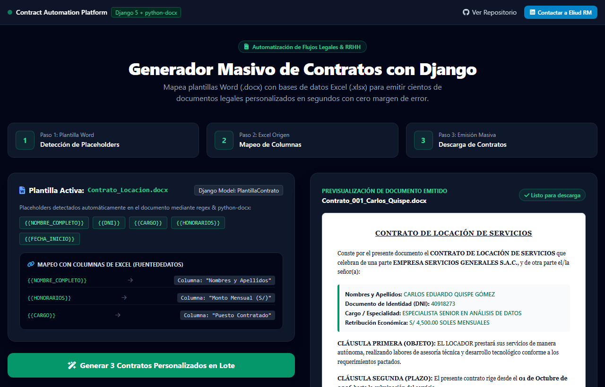
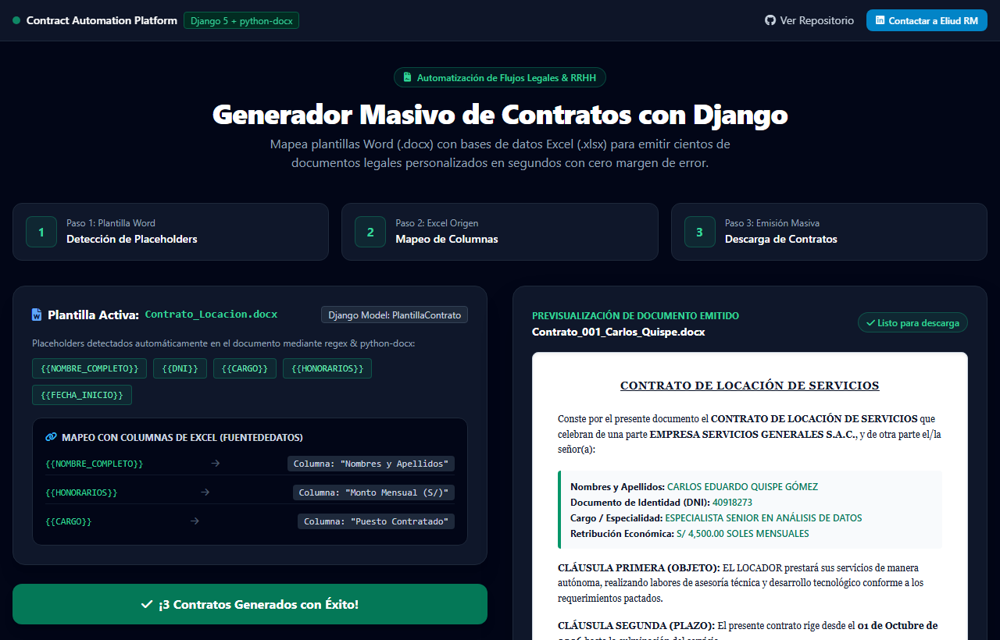

# 📄 Contract Automation System — Generador Masivo de Contratos con Django
> **Plataforma web empresarial para la generación masiva y automatizada de contratos legales y comerciales, combinando plantillas Word (.docx) con bases de datos Excel.**

  
  

  
  

---

## 📌 El Desafío de Negocio

En despachos legales, empresas inmobiliarias, departamentos de Recursos Humanos y agencias de servicios, la redacción de contratos es un cuello de botella constante:
- **Lentitud Operativa**: Redactar individualmente decenas o cientos de contratos cambiando manualmente nombres, DNIs, direcciones, sueldos o cláusulas específicas demora días completos de trabajo.
- **Riesgo Legal por Errores Humanos**: Una letra cambiada en un apellido, un dígito erróneo en el salario o una fecha incorrecta pueden anular la validez legal de un contrato o provocar litigios costosos.
- **Falta de Estandarización**: Dificultad para mantener actualizadas las versiones oficiales de las plantillas entre los miembros del equipo.

---

## 💡 La Solución Implementada

**Contract Automation System** es una aplicación web robusta desarrollada con el framework **Django** que centraliza, automatiza y asegura todo el ciclo de generación documental:

1. **Gestión Inteligente de Plantillas Word (`PlantillaContrato`)**:
   - Los usuarios suben formatos en `.docx`.
   - El sistema analiza el documento y **extrae automáticamente todos los marcadores o placeholders** dinámicos (ej: `{{NOMBRE_COMPLETO}}`, `{{DNI}}`, `{{SALARIO}}`), almacenándolos de manera estructurada en campos `JSONField`.
2. **Carga y Validación de Fuentes de Datos (`FuenteDeDatos`)**:
   - Soporte para archivos Excel (`.xlsx`) y mapeo dinámico de columnas.
3. **Generación por Lotes en Segundos**:
   - Combina la plantilla con cada fila del Excel, generando contratos individuales listos para firma.

👉 **[Prueba la Demo Interactiva en Vivo aquí](https://enybyy.github.io/contract-automation-system/)**

---

## 📈 Impacto y Mejoras Conseguidas

| Proceso | Método Tradicional (Manual) | Con Contract Automation System | Mejora Conseguida |
|---|---|---|---|
| **Tiempo de Generación (100 contratos)** | ~15 a 20 horas de tipeo y revisión | Menos de 15 segundos | **Reducción del 98% en tiempo operativo** |
| **Margen de Error Tipográfico** | Alta probabilidad (errores humanos en copiado/pegado) | Cero errores (mapeo directo desde la base de datos validada) | **Seguridad jurídica y precisión absoluta** |
| **Control de Versiones** | Archivos dispersos en carpetas locales | Plantillas centralizadas por usuario con control de acceso | **Estandarización corporativa de documentos** |
| **Autonomía del Usuario** | Dependencia de programadores para cambiar plantillas | Cualquier usuario sube su Word y el sistema detecta variables | **Adopción inmediata sin conocimientos técnicos** |

---

## 🛠️ Stack Tecnológico

- **Backend**: Python 3.13, Django Framework 5.x.
- **Procesamiento Documental**: `python-docx`, `openpyxl`, `pandas`.
- **Persistencia**: SQLite / PostgreSQL con modelos `JSONField`.

---

## 📬 ¿Quieres automatizar la documentación de tu empresa?

Desarrollo **plataformas web personalizadas en Django, sistemas SaaS para automatización de documentos y portales internos a medida**.

- **LinkedIn**: [Eliud RM](https://www.linkedin.com/in/eliud-rm/)
- **GitHub**: [@Enybyy](https://github.com/Enybyy)
- *Escríbeme para evaluar cómo automatizar los procesos documentales de tu negocio.*
